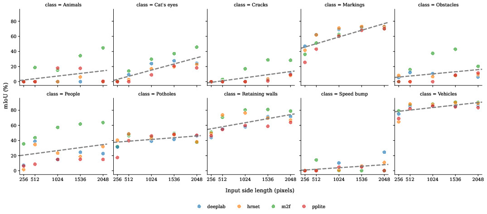
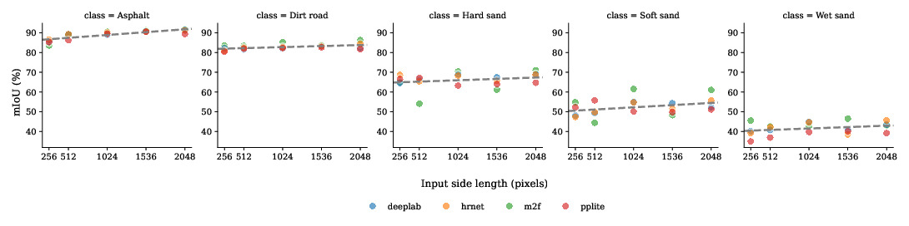

# FCDD: A High-Resolution Unstructured Environment Dataset with Multiple Sand Roads


> Autonomous-driving datasets under-represent unstructured, mixed-surface coastal roads, especially beaches and coastal roads where multiple sand types coexist. We identified three gaps in current unstructured environment datasets: (i) the absence of sand-based terrain within unstructured environments along with dirt and poorly maintained paved roads, (ii) the lack of distinction among sand terrains (soft, hard, and wet) despite their different traversability, and (iii) the scarcity of high-resolution data representing sand roads. To address these gaps, we introduce the Floripa Coast Driving Dataset (FCDD), a high-resolution (4K)  semantic-segmentation dataset covering a 12.2 km route across paved, dirt, and drivable beach roads. FCDD provides 500 annotated images (400 train / 100 val) with 17 classes organized into surfaces (asphalt, dirt road, soft sand, hard sand, wet sand), signs (markings, cat's eyes, retaining walls, speed bump), distress (cracks, potholes), and things (ego, vehicles, people, animals, obstacles). We also study the role of image resolution using four segmentation models (DeepLabV3+, HRNet, Mask2Former, PP-LiteSeg) across 256-2048 px. Performance improves markedly from 256 px to 512 px and continues up to 1536 px; small-sized classes (e.g., markings, cat's eyes, cracks) benefit the most from higher resolution, whereas surface classes show limited gains. These results indicate that ultra-high resolutions are unnecessary for differentiating road surfaces (512 px suffices), while mid-to-high resolutions (1536 px) maximize accuracy on small-sized categories.


Data is available at Mendeley [here](https://data.mendeley.com/datasets/7wr6hxk54h/1).

Paper is published at IEEE Access [here](https://ieeexplore.ieee.org/document/11231323/).

## How resolution affects performance across different models?


## How resolution affects performance across signs, distress and things classes?



## How resolution affects performance across road surfaces?




If this work help you, please consider citing it:
```
@ARTICLE{11231323,
  author={Toledo, Rafael De S. and De Oliveira, Cristiano S. and Andaló, Flávio and Von Wangenheim, Aldo},
  journal={IEEE Access}, 
  title={FCDD: A High-Resolution Unstructured Environment Dataset With Multiple Sand Roads}, 
  year={2025},
  volume={13},
  number={},
  pages={191531-191542},
  keywords={Roads;Surface cracks;Autonomous vehicles;Asphalt;Semantics;Surface texture;Sea measurements;Navigation;Moisture;Animals;Autonomous vehicle navigation;data sets for robotic vision;sand terrains;semantic scene understanding;unstructured environments},
  doi={10.1109/ACCESS.2025.3630348}}
```


